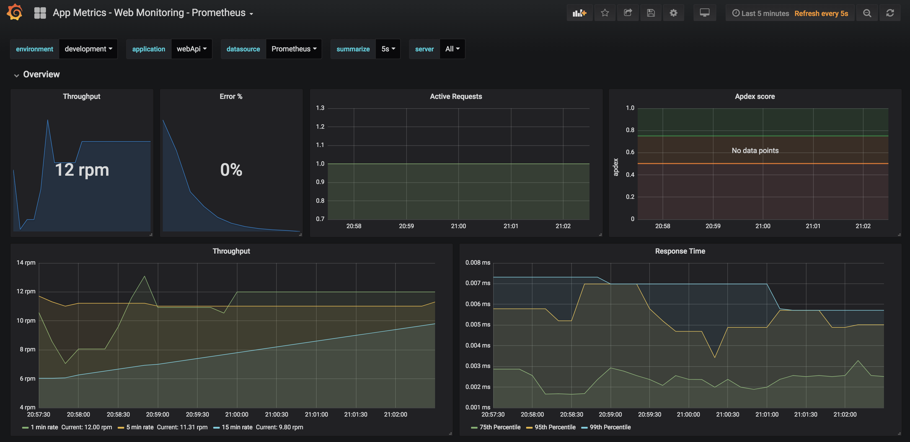

# Gerekli ön kurulumlar
Bilgisayarınızda docker ve docker-compose kurulu olması gerekiyor.

[Windows için kurulum](https://docs.docker.com/docker-for-windows/install/#start-docker-for-windows) 

[Mac için kurulum](https://docs.docker.com/docker-for-mac/install/)

## Prometheus , Grafana ve CAdvasor uygulamalarını çalıştırmak için;

Öncelikle Demo uygulamamızın metric lerini prometheus alması için
 /monitoring/prometheus/prometheus.yml dosyasındaki targets bölümündeki ip adresini bilgisayarınız ip adresi vermelisiniz.
 Çünkü prometheus docker container olarak çalıştığı için ve uygulamanızın bilgisayarınızda (container dışında çalıştığını varsayarsak) çalışıyor olacaktır.
 
 
```
  - job_name: 'my-app'
    scrape_interval: 5s
    metrics_path: /metrics-text
    static_configs:
         - targets: ['192.168.1.64:3333'] 
```

cd Demo/monitoring
İzleme bileşenlerini çalıştırmak için;
```
docker-compose up -d
```

Grafana Adresi : http://localhost:3000/

Prometheus adresi : http://localhost:9090/

Zipkin adresi : http://localhost:9411/zipkin/

Grafana adresinden dashboard açıldığında hazırda iki dashboard ile gelecektir.
* Docker Prometheus Monitoring : Çalıştırmış olduğunuz docker ve container hakkında metric sunacaktır.
* App Metric - Web Monitoring-Prometheus : webApi Demo uygulamasının ürettiği metric dashboard



### AppMetric grafana dashboard template

AppMetric Grafana hazır dashboard 

https://grafana.com/dashboards/2204