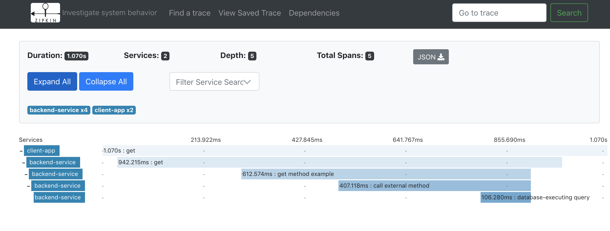
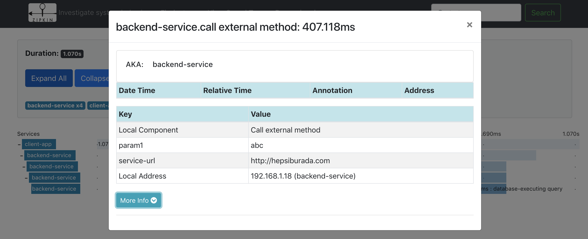

# .net core zipkin örneği

Dağınık sistemler arasında kolerasyon sağlayarak izleme örneği


### Ön Koşullar & Kurulum

Zipkin uygulamasının kurulu olması gerekmektedir. 

[Zipkin.io](https://zipkin.io/pages/quickstart.html)

Docker ile;
```
docker run -d -p 9411:9411 openzipkin/zipkin
```

Java ile; (Java 8+ kurulu olması gerekiyor.)

```
curl -sSL https://zipkin.io/quickstart.sh | bash -s
java -jar zipkin.jar
```


## Uygulamaların çalıştırılması

Backend-Service çalışması
```
cd Backend-Service
dotnet restore
dotnet build
dotnet run

```
http://127.0.0.1:5005 servis edilmektedir.

Client-App çalışması

```
cd Client-App
dotnet restore
dotnet build
dotnet run
```

## Test

````
curl http://127.0.0.1:8081

````
çalıştırıldıktan sonra http://127.0.0.1:9411 adresinden zipkin ile client-app => backend-service arasındaki
etkileşimi görebilirsiniz.

Sorgulama sonucunda bir isteğin kırılımlı detayı görüntülenmektedir.


"span" tıklandığında işlem adımı detayı görüntülenmektedir.




## Authors


## License


## Acknowledgments

